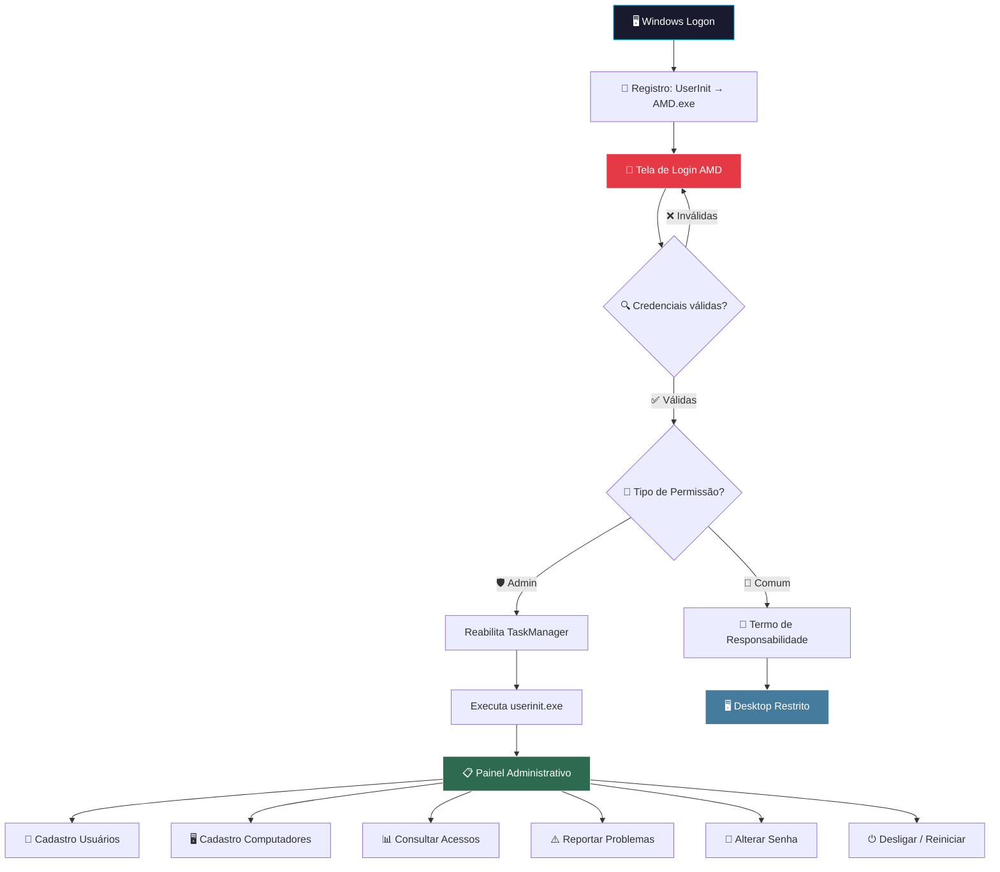
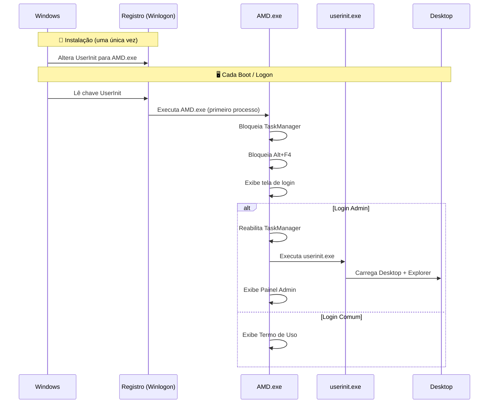
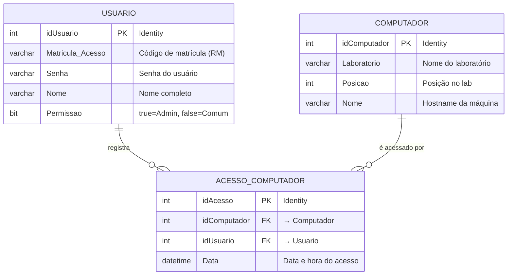

<div align="center">

# 🔐 Access Management Delta (AMD)

### Sistema de Controle de Acesso e Gerenciamento de Laboratórios de Informática

<br>

<p>
  
  
  
</p>

<p>
  
  
  
  
</p>

<br>

*Sistema profissional de segurança e controle de acesso para laboratórios educacionais, com autenticação obrigatória via matrícula, registro automático de logs de utilização, gerenciamento de máquinas e bloqueio completo do sistema operacional durante o processo de login.*

</div>

---

## 📖 Visão Geral

O **Access Management Delta (AMD)** é um software de **segurança e gerenciamento de laboratórios de informática** desenvolvido para ambientes educacionais. Ele foi projetado para ser executado como **o primeiro processo do Windows** (substituindo o `userinit.exe` padrão), garantindo que **nenhum aluno acesse o computador sem antes se autenticar** com sua matrícula e senha.

O sistema registra automaticamente **quem acessou qual máquina e em que horário**, permitindo ao administrador do laboratório ter controle total sobre o uso dos equipamentos.

### 🎯 Problema que Resolve

Em laboratórios de informática de escolas e instituições de ensino:
- Alunos acessam máquinas sem identificação → **não há rastreabilidade**
- Equipamentos são danificados sem saber quem usou → **sem responsabilização**
- O Task Manager pode ser aberto para fechar o sistema → **bypass de segurança**
- Não existe controle de quais máquinas estão cadastradas → **gestão precária**

O AMD resolve **todos esses problemas** de forma integrada e automatizada.

---

## ⚡ Funcionalidades Principais

<table width="100%">
<tr>
<td valign="top" width="50%">

### 🔑 Autenticação e Segurança
- **Login obrigatório** por matrícula + senha antes de acessar o Windows
- **Substituição do UserInit** — o AMD é o primeiro processo carregado após o logon do Windows
- **Bloqueio do Task Manager** (`Ctrl+Alt+Del`) durante a tela de login
- **Bloqueio de Alt+F4** — impossível fechar a tela de login por atalho
- **Dois níveis de permissão**: Administrador (acesso total) e Usuário Comum (acesso restrito)
- **Restauração automática** do `userinit.exe` após login de administrador

</td>
<td valign="top" width="50%">

### 📊 Gerenciamento e Monitoramento
- **Cadastro de Usuários** — CRUD completo com matrícula, nome, senha e nível de permissão
- **Cadastro de Computadores** — Registro de máquinas por laboratório, posição e hostname
- **Log de Acessos** — Registro automático de quem acessou qual máquina, com data e hora exatas
- **Consulta de Acessos** — Histórico completo para auditoria e gestão
- **Reporte de Problemas** — Alunos e professores podem reportar defeitos na máquina
- **Alteração de Senha** — Com logoff automático para reautenticação

</td>
</tr>
</table>

---

## 🏗️ Arquitetura do Sistema

### Fluxo de Inicialização e Autenticação



### Mecanismo de Segurança — UserInit Override



---

## 🗃️ Modelo de Dados



---

## 🗂️ Estrutura do Repositório

```
access-management-delta/
│
├── src/                              # 📦 Código-fonte do projeto C#
│   ├── AMD/                          # Projeto principal
│   │   ├── Program.cs                # Entry point da aplicação
│   │   ├── Acesso.cs                 # 🔐 Tela de login e autenticação
│   │   ├── Config/                   # Conexão SQL Server e variáveis globais
│   │   │   ├── clsDados.cs           # String de conexão
│   │   │   └── idAcessoClass.cs      # ID do acesso atual (variável pública)
│   │   ├── Desktop AMD/              # Painéis principais
│   │   │   ├── FRMdesktop_AMD_user_admin.cs  # 🛡️ Painel do Administrador
│   │   │   └── FRMdesktop_AMD_user_comun.cs  # 👤 Painel do Usuário Comum
│   │   ├── Cadastro/                 # Módulo de cadastros
│   │   │   ├── FRMCadastro_usuario.cs       # CRUD de Usuários
│   │   │   └── FRMCadastro_computador.cs    # CRUD de Computadores
│   │   ├── Consultar acesso/         # 📊 Log de acessos
│   │   │   └── FRMConsultar_acesso.cs
│   │   ├── Problema/                 # ⚠️ Reporte de problemas
│   │   │   └── FRMProblema_pc.cs
│   │   ├── Alterar senha/            # 🔑 Troca de senha
│   │   │   ├── AlterarSenha.cs
│   │   │   └── Fundo.cs
│   │   ├── Desligar computador/      # ⏻ Desligar / Reiniciar
│   │   │   └── FRMDesligar_Reiniciar.cs
│   │   ├── Termo/                    # 📄 Termo de responsabilidade
│   │   │   └── FRMTermo.cs
│   │   ├── Actors/                   # ℹ️ Sobre o software
│   │   │   └── Sobre.cs
│   │   └── Ajuda/                    # ❓ Tela de ajuda
│   │       └── Ajuda_acesso.cs
│   └── AMD.sln                       # Solution file do Visual Studio
│
├── database/                         # 🗄️ Scripts do banco de dados
│   └── schema.sql                    # DDL: Criação de tabelas (Usuario, Computador, Acesso_Computador)
│
├── setup/                            # ⚙️ Scripts de instalação e configuração
│   ├── definir_amd_como_primeiro_processo_do_windows.reg
│   ├── desabilitar_botão_desligar_windows_7.reg
│   └── manutencao/                   # 🔧 Scripts de manutenção (.bat)
│       ├── Excluir AMD.bat
│       ├── Ocultar AMD.bat
│       └── Tornar visivel pasta do AMD.bat
│
├── assets/                           # 🎨 Ícones e imagens do sistema
│   ├── Delta.ico                     # Ícone principal do AMD
│   ├── Login.png, User.png, key.png  # Ícones de interface
│   ├── PC.png, Problema.png          # Ícones de módulos
│   └── ...
│
├── .gitignore
└── README.md
```

---

## 🚀 Guia de Instalação e Deploy

### Pré-requisitos

| Componente | Versão Mínima |
|---|---|
| **Sistema Operacional** | Windows 7 / 8 / 10 / 11 |
| **IDE** | Visual Studio 2013+ (com .NET Desktop Development) |
| **.NET Framework** | 4.5+ |
| **Banco de Dados** | SQL Server 2012+ (ou SQL Server Express) |

### Passo a Passo

#### 1. Configurar o Banco de Dados
```sql
-- Crie o banco de dados
CREATE DATABASE AMD;
GO
USE AMD;
GO

-- Execute o script de criação das tabelas
-- (Arquivo: database/schema.sql)
```

#### 2. Configurar a String de Conexão
Edite o arquivo `src/AMD/Config/clsDados.cs` com os dados do seu SQL Server:
```csharp
public static string StringDeConexao = "Data Source=NOME_DO_SERVIDOR;Initial Catalog=AMD;Integrated Security=True";
```

#### 3. Compilar o Projeto
- Abra `src/AMD.sln` no Visual Studio
- Compile em modo **Release**
- O executável será gerado em `src/AMD/bin/Release/AMD.exe`

#### 4. Instalar como Primeiro Processo do Windows
```
⚠️ ATENÇÃO: Este passo substitui o processo de inicialização do Windows.
Certifique-se de ter acesso administrativo e um backup do registro.
```

1. Copie `AMD.exe` e dependências para `C:\AMD\`
2. Execute o arquivo `setup/definir_amd_como_primeiro_processo_do_windows.reg`
3. Reinicie o computador — o AMD será carregado antes do desktop

#### 5. Primeiro Acesso
- Use as credenciais padrão de administrador para o primeiro login
- Cadastre os computadores do laboratório (hostname será identificado automaticamente)
- Cadastre os usuários (alunos/professores) com suas matrículas

---

## 🔧 Mecanismos Técnicos de Segurança

### 1. UserInit Override (Registro do Windows)
```reg
[HKEY_LOCAL_MACHINE\SOFTWARE\Microsoft\Windows NT\CurrentVersion\Winlogon]
"Userinit"="C:\\AMD\\AMD.exe,"
```
O Windows carrega o AMD **antes** de qualquer outro processo de área de trabalho, incluindo o `explorer.exe`.

### 2. Bloqueio do Task Manager
```csharp
// Desabilita Ctrl+Alt+Del durante o login
RegistryKey regkey = Registry.CurrentUser.CreateSubKey(
    "Software\\Microsoft\\Windows\\CurrentVersion\\Policies\\System"
);
regkey.SetValue("DisableTaskMgr", "00000001");
```

### 3. Bloqueio de Fechamento Forçado
```csharp
// Impede Alt+F4 na tela de login
private void Acesso_FormClosing(object sender, FormClosingEventArgs e)
{
    e.Cancel = true;
    base.OnClosing(e);
}
```

### 4. Identificação Automática da Máquina
```csharp
// Detecta automaticamente o hostname da máquina
public string NomeMaquina = System.Net.Dns.GetHostName();
```

### 5. Registro de Acesso com Transação SQL
```csharp
// Registra quem acessou qual máquina com data/hora exata
// Utiliza SqlTransaction para garantir integridade dos dados
INSERT INTO Acesso_Computador (idComputador, idUsuario, Data)
VALUES (@idComputador, @idUsuario, @Data)
```

---

## 📋 Módulos do Sistema

| Módulo | Descrição | Acesso |
|---|---|---|
| 🔐 **Login** | Autenticação por matrícula + senha com bloqueio total do SO | Todos |
| 🛡️ **Painel Admin** | Dashboard com acesso a todos os módulos de gestão | Admin |
| 👤 **Painel Comum** | Interface restrita com termo de responsabilidade | Usuário |
| 👥 **Cadastro de Usuários** | Adicionar, editar e remover alunos/professores | Admin |
| 🖥️ **Cadastro de Computadores** | Registrar máquinas por laboratório e posição | Admin |
| 📊 **Consultar Acessos** | Histórico de quem acessou qual máquina e quando | Admin |
| ⚠️ **Reportar Problemas** | Registro de defeitos e problemas técnicos | Todos |
| 🔑 **Alterar Senha** | Troca de senha com logoff automático | Todos |
| ⏻ **Desligar / Reiniciar** | Controle de energia da máquina via interface | Todos |

---

## 🛠️ Tecnologias Utilizadas

<p align="center">
  
  
  
  
  
  
  
</p>

---

## ⚠️ Aviso Importante

> **Este software modifica chaves críticas do Registro do Windows** (`Winlogon\UserInit` e `DisableTaskMgr`). Utilize-o **apenas em ambientes controlados** (laboratórios de informática) e sempre mantenha acesso administrativo para reverter as configurações caso necessário.

> As credenciais padrão incluídas no código-fonte são **apenas para demonstração**. Em um ambiente de produção, configure credenciais seguras e utilize o cadastro de usuários pelo banco de dados.

---

## 👨‍💻 Desenvolvedor

<div align="center">

**Eduardo Junior Alcântara da Silva**

Professor de Programação, Informática e Robótica | Desenvolvedor Full Stack

<a href="https://www.prof-eduardo.com/" target="_blank"></a>
<a href="https://www.linkedin.com/in/edu7/" target="_blank"></a>
<a href="https://github.com/Eduardo00073" target="_blank"></a>

</div>

---

<div align="center">
  <i>Desenvolvido com 💻 para ambientes educacionais — Controle, segurança e rastreabilidade em laboratórios de informática.</i>
</div>

---

## ⭐ Gostou do projeto?

Se este projeto te ajudou, deixe uma estrela — isso ajuda outros desenvolvedores e gestores de laboratórios a encontrarem o repositório.

### 🔗 Outros projetos relacionados

💻 [C# — Console & Windows Forms](https://github.com/Eduardo00073/csharp-console-e-desktop) — projetos de console a aplicações desktop em C#.

🛡️ [Cybersecurity Labs](https://github.com/Eduardo00073/cybersecurity-labs) — laboratórios práticos de segurança da informação.
